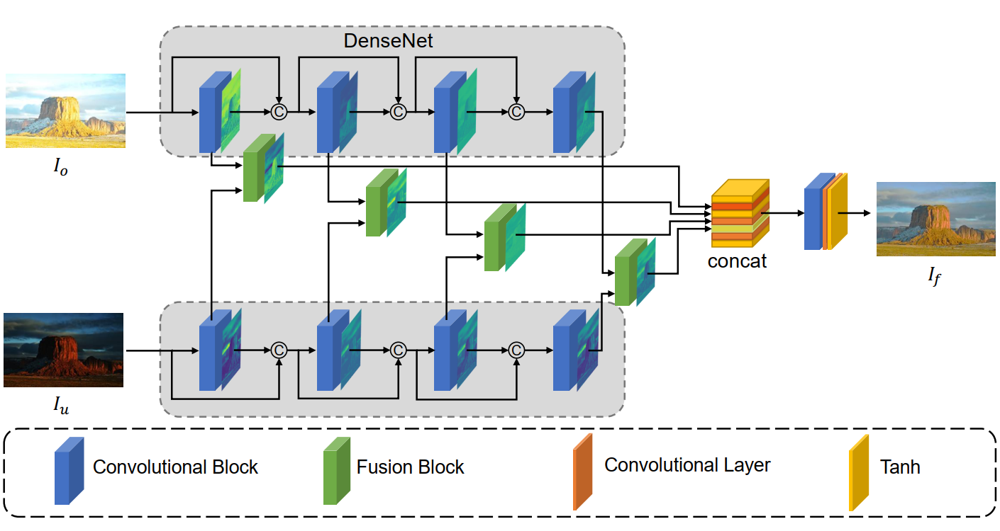

# MEF-SFI
Code for A Dual Domain Multi-exposure Image Fusion Network Based on the Spatial-frequency Integration.

Paper is accepted at [[Neurocomputing]](https://www.sciencedirect.com/science/article/pii/S0925231224009172)

# A Dual Domain Multi-exposure Image Fusion Network based on the Spatial-Frequency Integration
Multi-exposure image fusion aims to generate a single high-dynamic image by integrating images with different exposures. Existing deep learning-based multi-exposure image fusion methods primarily focus on spatial domain fusion, neglecting the global modeling ability of the frequency domain. To effectively leverage the global illumination modeling ability of the frequency domain, we propose a novelty perspective on multi-exposure image fusion via the Spatial-Frequency Integration Framework, named MEF-SFI. Initially, we revisit the properties of the Fourier transform on the 2D image, and verify the feasibility of multi-exposure image fusion on the frequency domain where the amplitude and phase component is able to guide the integration of the illumination information. Subsequently, we present the deep Fourier-based multi-exposure image fusion framework, which consists of a spatial path and frequency path for local and global modeling separately. Specifically, we introduce a Spatial-Frequency Fusion Block to facilitate efficient interaction between dual domains and capture complementary information from input images with different exposures. Finally, we combine a dual domain loss function to ensure the retention of complementary information in both the spatial and frequency domains. Extensive experiments on the PQA-MEF dataset demonstrate that our method achieves visual-appealing fusion results against state-of-the-art multi-exposure image fusion approaches.

# Environment
* Python 3.7
* Pytorch 1.8.0
* Opencv 4.5.0
* Numpy
* Matplotlib
* Kornia

# Training
Prepare your dataset and change the dataset path in the option.py.

Change line 32 of main.py to "train()".

The generated fusion model and log file locates at ./fusion_model/fusion_model.pth and ./fusion_log, respectively.

# Testing
Change line 32 of main.py to "test()".

# Contact Me
If you have any questions about the paper or code, please email to me ssyanguang@gmail.com.

